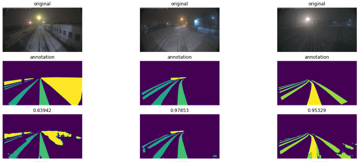

# NIIAS-RZD

Всероссийский чемпионат "Цифровой прорыв"
г. Москва
27 июля 2022 года

Задача «Разработка алгоритма определения
железнодорожной колеи и подвижного состава для
предотвращения чрезвычайных ситуаций на железной дороге»

1. Настройка окружения
2. Подготовка данных
3. Работа с моделью PSPNet
4. Работа с моделью Unet
5. Предикт готовой моделью
6. Презентация

https://github.com/serg-kas/NIIAS-RZD/blob/12a4896c1482415341928a21107ec18addd1f54a/demo.png
